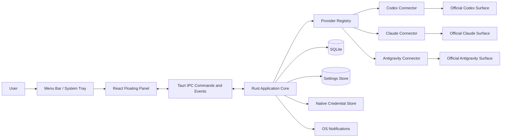
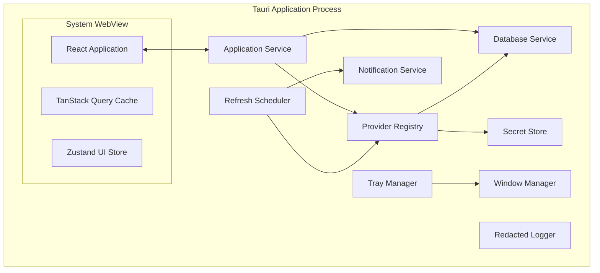
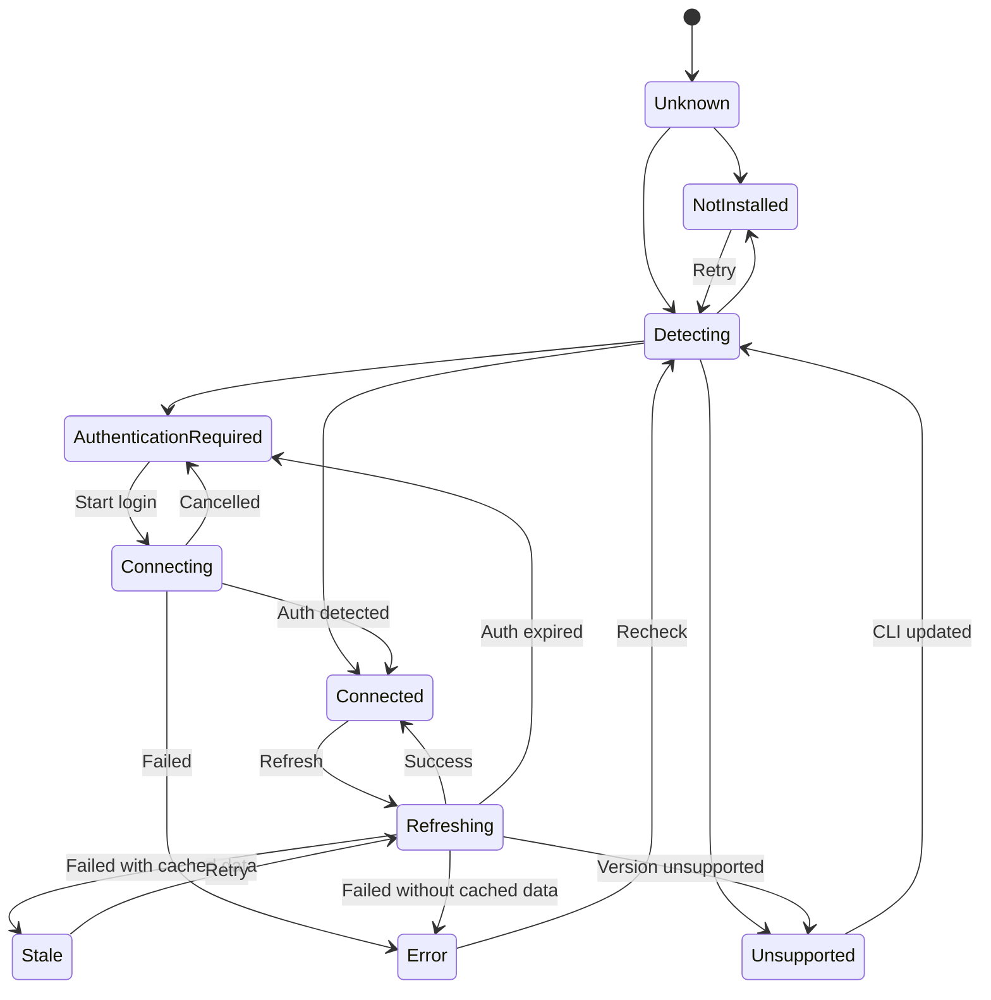
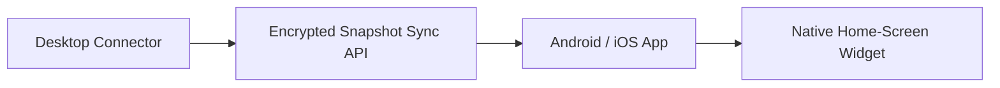

# Technical Design — AI Usage Dock

**Document status:** Draft v0.1 — implementation-ready after provider spike  
**Project:** AI Usage Dock  
**Date:** 2026-07-16  
**Primary platforms:** macOS and Windows  
**Future platforms:** Android and iOS  
**Related documents:**

- `docs/AI-Usage-Dock-PRD.md`
- `docs/AI-Usage-Dock-Technical-Spike.md`

---

## 1. Purpose

This document defines how AI Usage Dock will be implemented.

The PRD defines **what the product must do**.  
The Technical Spike determines **whether each provider can expose real subscription usage safely**.  
This Technical Design defines **the architecture, module boundaries, data contracts, persistence, security, testing, and delivery approach**.

This design intentionally does not assume that Codex, Claude, and Antigravity all provide the same integration mechanism.

Each provider may ultimately use one of these transports:

1. Official API
2. Official SDK
3. Official CLI JSON
4. Official CLI plain text
5. Interactive CLI through a pseudo-terminal
6. Official dashboard fallback
7. Unsupported state

The provider spike must select the transport used by each provider.

---

## 2. Design Status and Gate

The desktop architecture is approved for implementation.

Real provider connectors remain gated by:

```text
spike/results/decision.md
```

The following work may begin before the spike is complete:

- Tauri project scaffolding
- macOS Menu Bar and Windows System Tray
- floating panel
- frontend design system
- mock provider states
- normalized data contracts
- local database
- settings
- scheduler interfaces
- parser test infrastructure

The following work must not begin before the spike result exists:

- production Codex connector
- production Claude connector
- production Antigravity connector
- PTY dependency selection
- claims that a provider supports real subscription usage
- login buttons that imply unavailable OAuth access

---

## 3. Architecture Goals

The implementation must optimize for:

1. **Local-first operation**
2. **Small desktop footprint**
3. **Strict credential isolation**
4. **Independent provider connectors**
5. **Graceful degradation**
6. **Cross-platform desktop behavior**
7. **Testable parsers**
8. **Clear subscription/API separation**
9. **Future mobile reuse**
10. **Low maintenance when provider output changes**

---

## 4. Non-Functional Requirements

### 4.1 Security

- Provider passwords are never requested.
- Browser cookies are never read.
- Stored provider credentials never return to the frontend.
- Secrets are never written to SQLite, logs, analytics, or crash reports.
- CLI commands are executed without shell interpolation.
- Tauri permissions follow least privilege.
- Provider output is treated as untrusted input.

### 4.2 Performance

Initial targets:

| Metric                      |                                           Target |
| --------------------------- | -----------------------------------------------: |
| Cold start to tray ready    |               under 2 seconds on target machines |
| Popup open after tray click |                under 150 ms when already running |
| Cached dashboard render     |                                     under 100 ms |
| Memory while idle           | measure and keep below an initial 150 MB ceiling |
| Provider refresh timeout    |            provider-specific, default 20 seconds |
| Local history query         |                         under 100 ms for 30 days |
| UI animation                |                           60 FPS where supported |

These are engineering targets, not public guarantees.

### 4.3 Reliability

- One provider failure must not affect other providers.
- Only one refresh may run per provider at a time.
- Last successful snapshots remain available offline.
- Unknown output must produce an explicit parser error.
- Missing usage values must not silently become zero.
- Database migrations must be transactional.
- The app must recover after sleep, network loss, and CLI failure.

### 4.4 Privacy

The MVP has no first-party cloud backend.

All of these remain local:

- provider connection metadata;
- settings;
- usage snapshots;
- error logs;
- notification state;
- secrets.

---

## 5. Selected Technology Stack

## 5.1 Desktop shell

```text
Tauri 2
```

Responsibilities:

- application lifecycle;
- macOS Menu Bar;
- Windows System Tray;
- native window creation;
- background execution;
- autostart;
- notifications;
- single-instance behavior;
- updater;
- Rust-to-WebView IPC;
- platform-specific desktop integration.

Tauri uses a Rust application core and an operating-system WebView for the frontend. The framework supports desktop and mobile targets, but mobile-specific integrations still require platform work.

## 5.2 Frontend

```text
React
TypeScript
Vite
Tailwind CSS
shadcn/ui
Zustand
TanStack Query
Recharts
Zod
```

Responsibilities:

- rendering;
- provider tabs;
- usage graphs;
- settings UI;
- local view state;
- invoking typed Tauri commands;
- subscribing to backend events;
- formatting reset countdowns;
- showing cached, loading, stale, and error states.

### Frontend package responsibilities

| Package        | Responsibility                                |
| -------------- | --------------------------------------------- |
| React          | UI composition                                |
| TypeScript     | frontend type safety                          |
| Vite           | development and frontend build                |
| Tailwind CSS   | design tokens and utility styling             |
| shadcn/ui      | accessible UI primitives                      |
| Zustand        | local UI state                                |
| TanStack Query | command-backed query caching and invalidation |
| Recharts       | history visualizations                        |
| Zod            | runtime validation of IPC payloads            |

Versions must be pinned during project scaffolding and updated intentionally.

## 5.3 Rust application layer

```text
Rust
Tokio
Serde
SQLx with SQLite
Reqwest
thiserror
tracing
keyring ecosystem
secrecy / zeroize
```

Responsibilities:

- provider discovery;
- authentication-state detection;
- official CLI execution;
- PTY execution when approved by the spike;
- provider parsing;
- normalized usage calculation;
- API usage requests;
- database access;
- secure secret storage;
- refresh scheduling;
- notifications;
- logging;
- desktop lifecycle.

## 5.4 Secret storage decision

Desktop secrets will use native operating-system credential stores through a Rust keyring abstraction:

- macOS: native Keychain-backed store;
- Windows: native credential store;
- future Android/iOS: platform-native secure storage through mobile-specific implementation.

Tauri Stronghold remains an approved fallback if the native-keyring implementation proves unsuitable.

No stored secret is exposed through a read command to the frontend.

## 5.5 Persistence

```text
SQLite through SQLx  → structured application data and history
Tauri Store          → low-risk user preferences
Native keyring       → secrets
```

Database access occurs only in Rust.

The frontend does not execute SQL.

---

## 6. High-Level System Context



---

## 7. Runtime Architecture

AI Usage Dock runs as one desktop application process.



### Process model

- The Tauri core remains alive while the popup is hidden.
- Closing the popup does not terminate the app.
- Explicit **Quit** terminates the process.
- A single-instance guard prevents duplicate background processes.
- The popup WebView is created once and hidden/shown for fast reopening.
- Provider commands run in child processes or internal HTTP clients.
- Child processes are never started from frontend-supplied arbitrary commands.

---

## 8. Application Lifecycle

## 8.1 Startup

```text
Application starts
    ↓
Single-instance check
    ↓
Initialize redacted logging
    ↓
Resolve app-data directories
    ↓
Open SQLite connection pool
    ↓
Run database migrations
    ↓
Initialize settings
    ↓
Initialize secret store
    ↓
Register provider connectors
    ↓
Create hidden popup window
    ↓
Create Menu Bar / System Tray
    ↓
Start refresh scheduler
    ↓
Render cached state
```

If a non-critical provider fails to initialize, the app still starts.

If the database fails to open:

1. show a recoverable fatal-state window;
2. preserve the database file;
3. offer to open the logs directory;
4. do not silently delete data.

## 8.2 Tray click

```text
Tray icon clicked
    ↓
If popup visible → hide popup
If popup hidden  → position near tray
                  → show popup
                  → focus popup
                  → refresh stale providers when allowed
```

## 8.3 Focus loss

Default behavior:

```text
Popup loses focus
    ↓
No blocking modal or auth flow is active
    ↓
Hide popup
```

A temporary `prevent_auto_hide` guard is required while:

- an API-key modal is open;
- the operating-system credential prompt is active;
- a provider login process is being launched;
- a native dialog is open.

## 8.4 Quit

Only these actions terminate the app:

- tray menu → Quit;
- settings → Quit application;
- operating-system shutdown;
- fatal unrecoverable initialization failure.

---

## 9. Desktop Window Design

## 9.1 Main popup

Initial specification:

```text
Label: usage-popup
Width: 392 logical pixels
Height: 600 logical pixels
Minimum width: 360
Maximum width: 440
Visible at startup: false
Decorations: false
Resizable: false for MVP
Always on top: false by default
Skip taskbar: true on Windows
```

The popup height may be reduced dynamically when compact mode is enabled.

### Positioning

The window is positioned relative to the clicked tray icon where platform APIs allow it.

Fallback:

- macOS: constrained near the upper-right active display;
- Windows: constrained near the lower-right active work area.

Position must always remain inside the active monitor work area.

## 9.2 macOS behavior

- Use a template-style monochrome Menu Bar icon.
- Support optional text beside the icon.
- Default to an accessory/background-style app without a Dock icon.
- Allow the user to enable a Dock icon from Settings.
- Hide rather than destroy the popup.
- Support light and dark Menu Bar appearance.

## 9.3 Windows behavior

- Use a System Tray icon.
- Do not show the popup in the taskbar.
- Show a concise tooltip.
- Handle display scaling from 100% through 200%.
- Position the popup against the active taskbar area.
- Closing the popup hides it.

## 9.4 Native tray menu

Initial tray menu:

```text
Open AI Usage Dock
Refresh All
──────────────────
Codex          68%
Claude         42%
Antigravity    81%
──────────────────
Settings
Launch at Login   ✓
Quit
```

Provider summary rows are informational and may be disabled menu items.

---

## 10. Frontend Architecture

## 10.1 Frontend layers

```text
App shell
├── shared UI components
├── provider presentation
├── settings
├── query hooks
├── IPC client
├── runtime validation
└── local UI state
```

### Rule

The frontend contains presentation and interaction logic.

It must not contain:

- CLI command construction;
- provider output parsing;
- database queries;
- stored secret retrieval;
- API requests containing provider secrets;
- quota estimation that belongs to the provider layer.

## 10.2 Suggested frontend structure

```text
src/
├── app/
│   ├── App.tsx
│   ├── AppProviders.tsx
│   └── queryClient.ts
│
├── components/
│   ├── app-header/
│   ├── provider-tabs/
│   ├── usage-ring/
│   ├── usage-window-card/
│   ├── history-chart/
│   ├── reset-countdown/
│   ├── status-badge/
│   ├── connection-state/
│   └── settings-row/
│
├── features/
│   ├── dashboard/
│   ├── providers/
│   │   ├── codex/
│   │   ├── claude/
│   │   └── antigravity/
│   ├── settings/
│   ├── history/
│   └── connections/
│
├── ipc/
│   ├── commands.ts
│   ├── events.ts
│   ├── schemas.ts
│   └── types.ts
│
├── stores/
│   └── uiStore.ts
│
├── lib/
│   ├── dates.ts
│   ├── percentage.ts
│   └── formatError.ts
│
└── styles/
    └── tokens.css
```

## 10.3 State ownership

### TanStack Query

Use for backend-owned data:

- dashboard state;
- provider details;
- usage history;
- connection status;
- application settings;
- refresh result.

### Zustand

Use only for transient UI state:

- selected provider tab;
- compact-mode preview;
- open modal;
- temporary form visibility;
- auto-hide suppression;
- onboarding progress.

Do not duplicate provider data in Zustand.

## 10.4 Runtime validation

Every IPC response must be validated with Zod before entering the query cache.

Failure behavior:

```text
Invalid IPC payload
    ↓
Log schema mismatch without secrets
    ↓
Show internal contract error
    ↓
Do not render partial or fabricated usage
```

## 10.5 API key input handling

A user-entered API key necessarily exists briefly in WebView memory while being typed.

Mitigations:

- use an uncontrolled password input where practical;
- do not store the key in Zustand or TanStack Query;
- submit it immediately to a Rust command;
- clear the input after submission;
- never return the stored value from Rust;
- disable secret logging;
- disable autocomplete unless intentionally supported;
- document that developer tools must not be used during real-key testing.

---

## 11. Rust Backend Architecture

## 11.1 Suggested backend structure

```text
src-tauri/src/
├── lib.rs
├── app_state.rs
│
├── commands/
│   ├── app.rs
│   ├── providers.rs
│   ├── connections.rs
│   ├── history.rs
│   └── settings.rs
│
├── domain/
│   ├── provider.rs
│   ├── usage.rs
│   ├── connection.rs
│   ├── settings.rs
│   └── error.rs
│
├── providers/
│   ├── mod.rs
│   ├── registry.rs
│   ├── codex/
│   │   ├── mod.rs
│   │   ├── connector.rs
│   │   └── parser.rs
│   ├── claude/
│   │   ├── mod.rs
│   │   ├── connector.rs
│   │   └── parser.rs
│   └── antigravity/
│       ├── mod.rs
│       ├── connector.rs
│       └── parser.rs
│
├── process/
│   ├── runner.rs
│   ├── detector.rs
│   ├── output.rs
│   └── pty.rs
│
├── database/
│   ├── mod.rs
│   ├── migrations.rs
│   ├── connections_repo.rs
│   ├── snapshots_repo.rs
│   └── notifications_repo.rs
│
├── secrets/
│   ├── mod.rs
│   ├── native_keyring.rs
│   └── stronghold_fallback.rs
│
├── scheduler/
│   ├── mod.rs
│   ├── backoff.rs
│   └── wake.rs
│
├── desktop/
│   ├── tray.rs
│   ├── window.rs
│   ├── autostart.rs
│   └── notifications.rs
│
└── telemetry/
    ├── logging.rs
    └── redaction.rs
```

## 11.2 Shared application state

Conceptual structure:

```rust
pub struct AppState {
    pub database: Database,
    pub providers: ProviderRegistry,
    pub secrets: Arc<dyn SecretStore>,
    pub scheduler: RefreshScheduler,
    pub refresh_locks: ProviderRefreshLocks,
    pub settings: SettingsService,
    pub notifications: NotificationService,
}
```

All services must be safe to share across asynchronous Tauri commands.

---

## 12. Domain Model

## 12.1 Provider identity

```rust
#[derive(Debug, Clone, Copy, Serialize, Deserialize, PartialEq, Eq, Hash)]
#[serde(rename_all = "kebab-case")]
pub enum ProviderId {
    Codex,
    Claude,
    Antigravity,
}
```

## 12.2 Connection type

```rust
#[derive(Debug, Clone, Serialize, Deserialize)]
#[serde(rename_all = "kebab-case")]
pub enum ConnectionType {
    SubscriptionCli,
    OAuthCli,
    ApiKey,
    AdminApiKey,
    CloudProject,
    DashboardOnly,
}
```

## 12.3 Reliability

```rust
#[derive(Debug, Clone, Serialize, Deserialize)]
#[serde(rename_all = "kebab-case")]
pub enum Reliability {
    OfficialApi,
    OfficialSdk,
    OfficialCliJson,
    OfficialCliText,
    ExperimentalPty,
    Manual,
    DashboardOnly,
}
```

## 12.4 Usage period

```rust
#[derive(Debug, Clone, Serialize, Deserialize)]
#[serde(rename_all = "kebab-case")]
pub enum UsagePeriod {
    Session,
    FiveHour,
    Daily,
    Weekly,
    Monthly,
    ModelSpecific,
    Unknown,
}
```

## 12.5 Normalized usage

```rust
#[derive(Debug, Clone, Serialize, Deserialize)]
#[serde(rename_all = "camelCase")]
pub struct UsageWindow {
    pub id: String,
    pub label: String,
    pub period: UsagePeriod,
    pub model: Option<String>,
    pub used_percent: Option<f64>,
    pub remaining_percent: Option<f64>,
    pub reset_at: Option<DateTime<Utc>>,
}

#[derive(Debug, Clone, Serialize, Deserialize)]
#[serde(rename_all = "camelCase")]
pub struct ProviderUsage {
    pub provider: ProviderId,
    pub connection_type: ConnectionType,
    pub account_label: Option<String>,
    pub plan_name: Option<String>,
    pub windows: Vec<UsageWindow>,
    pub token_usage: Option<TokenUsage>,
    pub cost_usage: Option<CostUsage>,
    pub reliability: Reliability,
    pub fetched_at: DateTime<Utc>,
    pub stale: bool,
    pub warnings: Vec<UsageWarning>,
}
```

### Percentage rules

- Values must be within `0..=100`.
- If only remaining percentage exists, used percentage may be derived as `100 - remaining`.
- If only used percentage exists, remaining percentage may be derived as `100 - used`.
- Derived values must be marked internally.
- Rounded display values must not replace stored precision.
- Unknown values remain `None`.

---

## 13. Provider Connector Architecture

## 13.1 Capabilities

A provider connector reports its capabilities rather than forcing every provider into identical behavior.

```rust
#[derive(Debug, Clone, Serialize, Deserialize)]
#[serde(rename_all = "camelCase")]
pub struct ProviderCapabilities {
    pub can_detect_installation: bool,
    pub can_detect_authentication: bool,
    pub can_start_login: bool,
    pub can_fetch_subscription_usage: bool,
    pub can_fetch_api_usage: bool,
    pub can_disconnect_local_connection: bool,
    pub requires_tty: bool,
    pub supports_multiple_windows: bool,
    pub supports_model_windows: bool,
}
```

## 13.2 Connector interface

Conceptual interface:

```rust
#[async_trait::async_trait]
pub trait ProviderConnector: Send + Sync {
    fn id(&self) -> ProviderId;

    fn capabilities(&self) -> ProviderCapabilities;

    async fn detect_installation(
        &self,
    ) -> Result<InstallationStatus, AppError>;

    async fn detect_authentication(
        &self,
    ) -> Result<AuthenticationStatus, AppError>;

    async fn start_login(
        &self,
    ) -> Result<LoginLaunchResult, AppError>;

    async fn fetch_usage(
        &self,
        context: FetchContext,
    ) -> Result<ProviderUsage, AppError>;

    async fn disconnect(
        &self,
    ) -> Result<(), AppError>;
}
```

The exact trait implementation may use enum dispatch instead of dynamic dispatch if that produces simpler Rust.

## 13.3 Connector composition

```text
Provider
├── Subscription connector
├── API connector
└── Dashboard fallback
```

Example:

```text
CodexProvider
├── CodexSubscriptionConnector
├── OpenAIUsageApiConnector
└── CodexDashboardFallback
```

Subscription and API results remain distinct.

## 13.4 Registry

```rust
pub struct ProviderRegistry {
    providers: HashMap<ProviderId, Arc<dyn ProviderConnector>>,
}
```

Responsibilities:

- return provider metadata;
- route refresh requests;
- isolate provider failures;
- expose capability information;
- support mock connectors in development;
- support fake connectors in tests.

---

## 14. Provider Transport Layer

Provider connectors must depend on transport interfaces rather than directly spawning processes.

## 14.1 Process runner

```rust
#[async_trait::async_trait]
pub trait ProcessRunner: Send + Sync {
    async fn run(
        &self,
        request: ProcessRequest,
    ) -> Result<ProcessOutput, ProcessError>;
}
```

```rust
pub struct ProcessRequest {
    pub executable: PathBuf,
    pub arguments: Vec<OsString>,
    pub environment: HashMap<OsString, OsString>,
    pub timeout: Duration,
    pub max_output_bytes: usize,
    pub requires_tty: bool,
}
```

### Mandatory rules

- Use an absolute executable path after detection.
- Never construct one shell command string.
- Arguments come from an allowlisted provider implementation.
- Do not accept executable paths directly from frontend commands.
- Enforce timeouts.
- Kill the child process tree on timeout where supported.
- Cap stdout and stderr.
- Preserve exit code and signal information.
- Strip or normalize ANSI only after retaining a private debug representation.
- Never log environment variables.

## 14.2 PTY support

A PTY implementation is optional and must only be included when approved by the provider spike.

Required PTY behavior:

- fixed known terminal size;
- explicit UTF-8 handling;
- bounded output;
- deterministic command sequence;
- no arbitrary keystrokes from frontend;
- timeout and cancellation;
- version-aware parser;
- test fixtures for every supported CLI version family.

## 14.3 HTTP transport

API connectors use Rust HTTP clients.

Rules:

- requests are sent from Rust, not the WebView;
- secrets are loaded directly from `SecretStore`;
- explicit connect and read timeouts;
- bounded response bodies;
- TLS verification remains enabled;
- provider errors are mapped into normalized error codes;
- raw response bodies are not logged.

---

## 15. CLI Detection and Trust

## 15.1 Detection

Detection checks platform-standard locations and `PATH`.

Result:

```rust
pub struct InstallationStatus {
    pub installed: bool,
    pub executable_path: Option<PathBuf>,
    pub version: Option<String>,
    pub trusted: InstallationTrust,
}
```

## 15.2 Trust model

A malicious executable earlier in `PATH` could impersonate a provider CLI.

Mitigations:

- resolve and store the absolute path;
- show the detected path in advanced settings;
- ask for confirmation when the path changes unexpectedly;
- store the last approved executable path;
- record the detected version;
- optionally inspect platform signing metadata later;
- never pass provider secrets to an unapproved changed executable.

Trust states:

```text
detected
approved
path-changed
version-unsupported
missing
```

---

## 16. Provider Parser Architecture

## 16.1 Parser interface

```rust
pub trait UsageParser: Send + Sync {
    fn supports_version(&self, version: &Version) -> bool;

    fn parse(
        &self,
        input: &str,
        context: ParseContext,
    ) -> Result<ProviderUsage, ParserError>;
}
```

## 16.2 Parser rules

- Normalize line endings.
- Remove ANSI control sequences.
- Treat terminal output as untrusted.
- Do not execute hyperlinks or escape sequences.
- Validate every percentage.
- Validate reset timestamps.
- Support locale-specific formatting only when fixtures exist.
- Never fabricate values.
- Reject unsupported CLI versions when output cannot be trusted.
- Preserve source reliability.
- Return typed warnings for partially available data.

## 16.3 Version strategy

```text
Provider parser
├── parser_v1
├── parser_v2
└── unsupported
```

Parser selection is based on:

1. CLI version;
2. output signature;
3. known fixture family.

Do not rely only on loose regular expressions against arbitrary output.

## 16.4 Fixture strategy

```text
fixtures/
└── <provider>/
    └── <version-family>/
        ├── authenticated-normal.txt
        ├── near-limit.txt
        ├── exhausted.txt
        ├── logged-out.txt
        ├── offline.txt
        └── malformed.txt
```

Fixtures must be sanitized before commit.

---

## 17. Tauri IPC Contract

The frontend invokes a narrow set of typed commands.

The frontend must not have generic shell, file-system, or database access.

## 17.1 Commands

### Application

```text
get_app_bootstrap
show_popup
hide_popup
quit_app
```

### Providers

```text
list_providers
get_provider_state
refresh_provider
refresh_all_providers
detect_provider_installation
start_provider_login
disconnect_provider
open_provider_dashboard
```

### API connections

```text
save_provider_api_key
delete_provider_api_key
validate_provider_api_connection
```

There is intentionally no:

```text
get_provider_api_key
```

### History

```text
get_usage_history
clear_usage_history
```

### Settings

```text
get_settings
update_settings
set_launch_at_login
```

## 17.2 Example request

```ts
type RefreshProviderRequest = {
  provider: "codex" | "claude" | "antigravity";
  reason: "manual" | "startup" | "scheduled" | "popup-open" | "wake";
};
```

## 17.3 Example response envelope

```ts
type CommandResult<T> =
  | {
      ok: true;
      data: T;
      requestId: string;
    }
  | {
      ok: false;
      error: AppErrorPayload;
      requestId: string;
    };
```

Tauri commands may use native rejected promises internally, but the frontend IPC wrapper should normalize failures consistently.

---

## 18. Backend Event Contract

Rust emits events for asynchronous state changes.

```text
provider://refresh-started
provider://refresh-completed
provider://refresh-failed
provider://authentication-changed
provider://installation-changed
settings://changed
app://network-state-changed
app://wake
```

Example payload:

```ts
type ProviderRefreshCompletedEvent = {
  provider: ProviderId;
  fetchedAt: string;
  changed: boolean;
};
```

The frontend handles events by invalidating TanStack Query keys.

Do not send stored secrets or raw CLI output through events.

---

## 19. Provider State Machine



The UI state is derived from backend provider state and cached usage.

---

## 20. Refresh Scheduler

## 20.1 Default policy

Default refresh interval:

```text
5 minutes
```

Configurable options:

```text
1 minute
5 minutes
10 minutes
15 minutes
30 minutes
Manual only
```

The one-minute option may be disabled per provider when it would be wasteful or unsupported.

## 20.2 Refresh triggers

- application startup;
- scheduled interval;
- manual refresh;
- popup opened while data is stale;
- computer wake;
- network restored;
- authentication completed;
- provider CLI version changed.

## 20.3 Single-flight behavior

Only one refresh runs per provider.

```text
Second refresh request arrives
    ↓
Existing refresh still active
    ↓
Reuse or await existing task
```

A refresh of Claude must not block Codex or Antigravity.

## 20.4 Backoff

Suggested retry backoff:

```text
1 minute
5 minutes
15 minutes
30 minutes
```

Backoff resets after success.

Authentication and unsupported-version errors do not use network retry backoff.

## 20.5 Jitter

Scheduled refreshes use a small local jitter to avoid all providers running at exactly the same instant.

## 20.6 Freshness rules

Initial defaults:

| State            | Rule                                                  |
| ---------------- | ----------------------------------------------------- |
| Fresh            | latest successful fetch is within 2 refresh intervals |
| Stale            | older than 2 refresh intervals                        |
| Expired snapshot | older than 24 hours                                   |
| Unknown          | no successful snapshot                                |

Stale values may still be displayed with timestamp and warning.

---

## 21. Persistence Design

## 21.1 Data ownership

| Data                         | Storage                      |
| ---------------------------- | ---------------------------- |
| UI preferences               | Tauri Store                  |
| Provider connection metadata | SQLite                       |
| Usage snapshots              | SQLite                       |
| Notification deduplication   | SQLite                       |
| App event logs               | rolling files                |
| API/Admin secrets            | native keyring               |
| Official CLI auth            | owned by provider CLI        |
| Raw parser fixtures          | repository, sanitized        |
| Raw development captures     | `.private/`, never committed |

## 21.2 SQLite location

Store the database under the operating-system application data directory.

Example logical path:

```text
<AppData>/AI Usage Dock/ai-usage-dock.sqlite3
```

Do not place the database in the repository or current working directory.

## 21.3 SQLite configuration

Recommended:

- WAL journal mode;
- foreign keys enabled;
- busy timeout;
- transactional migrations;
- UTC timestamps;
- connection pool with a small maximum suitable for a desktop app.

---

## 22. Database Schema

## 22.1 Provider connections

```sql
CREATE TABLE provider_connections (
    id TEXT PRIMARY KEY,
    provider TEXT NOT NULL,
    connection_type TEXT NOT NULL,
    account_label TEXT,
    plan_name TEXT,
    status TEXT NOT NULL,
    executable_path TEXT,
    cli_version TEXT,
    reliability TEXT,
    last_success_at TEXT,
    last_attempt_at TEXT,
    last_error_code TEXT,
    last_error_message TEXT,
    created_at TEXT NOT NULL,
    updated_at TEXT NOT NULL,

    UNIQUE(provider, connection_type)
);
```

No secret is stored in this table.

## 22.2 Usage snapshots

```sql
CREATE TABLE usage_snapshots (
    id TEXT PRIMARY KEY,
    provider TEXT NOT NULL,
    connection_type TEXT NOT NULL,
    account_label TEXT,
    plan_name TEXT,
    reliability TEXT NOT NULL,
    fetched_at TEXT NOT NULL,
    captured_at TEXT NOT NULL,
    stale INTEGER NOT NULL DEFAULT 0,
    warning_json TEXT
);

CREATE INDEX idx_usage_snapshots_provider_time
ON usage_snapshots(provider, captured_at DESC);
```

## 22.3 Usage windows

```sql
CREATE TABLE usage_windows (
    id TEXT PRIMARY KEY,
    snapshot_id TEXT NOT NULL,
    external_window_id TEXT NOT NULL,
    label TEXT NOT NULL,
    period TEXT NOT NULL,
    model TEXT,
    used_percent REAL,
    remaining_percent REAL,
    reset_at TEXT,
    derived_used_percent INTEGER NOT NULL DEFAULT 0,
    derived_remaining_percent INTEGER NOT NULL DEFAULT 0,

    FOREIGN KEY(snapshot_id)
        REFERENCES usage_snapshots(id)
        ON DELETE CASCADE,

    CHECK(used_percent IS NULL OR
          (used_percent >= 0 AND used_percent <= 100)),

    CHECK(remaining_percent IS NULL OR
          (remaining_percent >= 0 AND remaining_percent <= 100))
);

CREATE INDEX idx_usage_windows_snapshot
ON usage_windows(snapshot_id);
```

## 22.4 API usage totals

```sql
CREATE TABLE api_usage_totals (
    id TEXT PRIMARY KEY,
    snapshot_id TEXT NOT NULL,
    input_tokens INTEGER,
    output_tokens INTEGER,
    cached_tokens INTEGER,
    request_count INTEGER,
    cost_used REAL,
    budget REAL,
    currency TEXT,

    FOREIGN KEY(snapshot_id)
        REFERENCES usage_snapshots(id)
        ON DELETE CASCADE
);
```

## 22.5 Notification states

```sql
CREATE TABLE notification_states (
    id TEXT PRIMARY KEY,
    provider TEXT NOT NULL,
    connection_type TEXT NOT NULL,
    window_key TEXT NOT NULL,
    threshold INTEGER NOT NULL,
    period_identifier TEXT NOT NULL,
    notified_at TEXT NOT NULL,

    UNIQUE(
        provider,
        connection_type,
        window_key,
        threshold,
        period_identifier
    )
);
```

## 22.6 Provider executable approvals

```sql
CREATE TABLE provider_executables (
    provider TEXT PRIMARY KEY,
    executable_path TEXT NOT NULL,
    cli_version TEXT,
    approval_status TEXT NOT NULL,
    approved_at TEXT,
    last_seen_at TEXT NOT NULL
);
```

---

## 23. History Retention

Default history retention:

```text
30 days
```

Optional settings:

```text
7 days
30 days
90 days
Keep indefinitely
```

Cleanup runs:

- once after startup;
- then at most once per day.

The cleanup task deletes expired snapshots in one transaction.

Aggregate history can be introduced later if long-term retention becomes necessary.

---

## 24. Settings Model

```ts
type AppSettings = {
  launchAtLogin: boolean;
  startMinimized: boolean;
  showDockIcon: boolean;
  closePanelWhenUnfocused: boolean;

  menuBar: {
    showPercentage: boolean;
    displayedUsage: "highest" | "codex" | "claude" | "antigravity";
    warningThreshold: number;
    criticalThreshold: number;
  };

  refresh: {
    enabled: boolean;
    intervalMinutes: 1 | 5 | 10 | 15 | 30;
    refreshAfterWake: boolean;
    refreshWhenPopupOpens: boolean;
  };

  appearance: {
    theme: "system" | "light" | "dark";
    compactMode: boolean;
  };

  data: {
    historyRetentionDays: 7 | 30 | 90 | null;
  };

  notifications: {
    warning: boolean;
    critical: boolean;
    quotaReset: boolean;
    authExpired: boolean;
  };
};
```

Settings changes are validated in both TypeScript and Rust.

---

## 25. Secret Storage

## 25.1 Secret keys

Logical secret identifiers:

```text
ai-usage-dock/openai/admin-api-key
ai-usage-dock/anthropic/admin-api-key
ai-usage-dock/google/api-key
```

Use provider account identifiers in the key only after sanitization.

## 25.2 Secret interface

```rust
#[async_trait::async_trait]
pub trait SecretStore: Send + Sync {
    async fn set(
        &self,
        key: SecretKey,
        value: SecretString,
    ) -> Result<(), SecretStoreError>;

    async fn exists(
        &self,
        key: SecretKey,
    ) -> Result<bool, SecretStoreError>;

    async fn with_secret<T>(
        &self,
        key: SecretKey,
        operation: impl FnOnce(&str) -> Result<T, AppError> + Send,
    ) -> Result<T, AppError>;

    async fn delete(
        &self,
        key: SecretKey,
    ) -> Result<(), SecretStoreError>;
}
```

A production implementation may use a different Rust shape to remain object-safe.

The important rule is that secrets are consumed inside Rust and are not returned as ordinary strings to the frontend.

## 25.3 Secret lifecycle

```text
User submits secret
    ↓
Rust validates format
    ↓
Optional provider validation request
    ↓
Secret saved in native credential store
    ↓
Frontend input is cleared
    ↓
Only connection metadata is saved in SQLite
```

On disconnect:

```text
Delete secret
    ↓
Delete or deactivate connection metadata
    ↓
Retain historical snapshots unless user clears them
```

---

## 26. Error Model

## 26.1 Error categories

```rust
pub enum AppErrorCode {
    CliNotInstalled,
    CliPathChanged,
    CliVersionUnsupported,
    NotAuthenticated,
    AuthenticationExpired,
    AuthenticationCancelled,
    PermissionDenied,
    NetworkUnavailable,
    ProviderRateLimited,
    ProviderUnavailable,
    CommandTimeout,
    CommandFailed,
    OutputTooLarge,
    OutputUnrecognized,
    ParserVersionUnsupported,
    InvalidCredential,
    SecretStoreUnavailable,
    DatabaseUnavailable,
    MigrationFailed,
    InternalContractError,
    Unknown,
}
```

## 26.2 Frontend error payload

```ts
type AppErrorPayload = {
  code: AppErrorCode;
  title: string;
  message: string;
  provider?: ProviderId;
  retryable: boolean;
  action?:
    | "retry"
    | "login"
    | "install-cli"
    | "open-dashboard"
    | "approve-path"
    | "open-settings";
  occurredAt: string;
};
```

Messages must be user-safe and must not contain:

- raw commands;
- raw provider responses;
- secrets;
- complete file-system paths unless explicitly shown in advanced diagnostics;
- stack traces.

---

## 27. Notification Design

## 27.1 Threshold notifications

Default thresholds:

```text
Warning: 80% used
Critical: 95% used
```

A notification key contains:

```text
provider
connection type
quota-window identifier
threshold
quota-period identifier
```

This prevents duplicate notifications during one quota period.

## 27.2 Reset notification

Send only when:

- a previous snapshot was exhausted or above the critical threshold;
- a newer snapshot indicates the quota has reset;
- the reset notification is enabled.

## 27.3 Authentication notification

Send once when an active connected provider transitions to:

```text
authentication-required
```

Do not repeatedly notify on every scheduled refresh.

---

## 28. Tray Summary Calculation

## 28.1 Highest-usage algorithm

Candidates:

- connected providers;
- fresh or stale snapshots that have known percentages;
- all visible quota windows.

Default selected value:

```text
maximum usedPercent
```

Tie-break:

1. critical status;
2. shortest reset time;
3. provider display order.

## 28.2 No available percentage

Display icon only when:

- no providers are connected;
- all values are unknown;
- only dashboard fallbacks exist.

## 28.3 Status styling

Suggested states:

```text
Normal       < 80%
Warning      80–94.99%
Critical     ≥ 95%
Stale        known value but outdated
Disconnected no usable provider
Error        refresh failed without cached data
```

Menu Bar template icons cannot depend solely on color. Use shape, badge, or text as an additional signal.

---

## 29. Offline Behavior

When offline:

- skip API refresh attempts after network failure is confirmed;
- CLI connectors may still be invoked only when their usage command can work offline;
- show the most recent successful snapshot;
- mark the snapshot stale;
- keep reset countdown based on stored timestamp;
- never claim that quota has reset without a successful provider refresh;
- retry after network recovery using backoff.

The frontend should display:

```text
Offline · Last updated 42 minutes ago
```

---

## 30. Security Design

## 30.1 Threats and mitigations

### Secret leakage through frontend state

Mitigation:

- never return stored secrets;
- avoid global frontend secret state;
- clear inputs immediately;
- disable secret logging.

### Shell injection

Mitigation:

- direct process spawning;
- absolute executable paths;
- allowlisted arguments;
- no arbitrary command IPC.

### Malicious executable in PATH

Mitigation:

- path approval;
- path-change warning;
- version recording;
- optional signing verification later.

### Malicious terminal output

Mitigation:

- output-size limit;
- ANSI stripping;
- parser validation;
- no HTML rendering from provider output;
- no automatic hyperlink execution.

### Parser silently producing wrong usage

Mitigation:

- version-aware parsers;
- fixture tests;
- typed unsupported state;
- visible reliability label;
- no default zero.

### Database tampering

Mitigation:

- schema constraints;
- migration transactions;
- invalid values rejected;
- treat local data as display cache, not billing authority.

### Update compromise

Mitigation:

- signed update artifacts;
- HTTPS update endpoint;
- verify update signature;
- no unsigned automatic installation.

### Over-permissioned WebView

Mitigation:

- narrowly scoped Tauri capabilities;
- no generic shell permission;
- no direct file-system permission unless required;
- strict Content Security Policy;
- only known application windows receive IPC access.

## 30.2 Content Security Policy

Initial policy should block remote scripts and arbitrary connections.

Conceptual CSP:

```text
default-src 'self';
script-src 'self';
style-src 'self' 'unsafe-inline';
img-src 'self' asset: data:;
connect-src ipc: http://ipc.localhost;
font-src 'self';
object-src 'none';
frame-src 'none';
base-uri 'none';
```

The exact Tauri CSP must be validated against the generated application and development mode.

Provider HTTP requests stay in Rust, so remote provider domains do not need to be added to the WebView CSP.

## 30.3 Tauri capabilities

Create separate capability files for:

- main usage popup;
- settings window, if separated later.

Only enable permissions actually required by those windows.

---

## 31. Logging and Diagnostics

## 31.1 Logging

Use structured Rust logging.

Levels:

```text
ERROR
WARN
INFO
DEBUG
TRACE
```

Production default:

```text
INFO
```

## 31.2 Redaction

Redact:

- API keys;
- bearer tokens;
- session IDs;
- complete email addresses where unnecessary;
- home-directory user names;
- raw process environments;
- raw HTTP authorization headers.

## 31.3 Rolling logs

Store rolling local logs with:

- maximum file size;
- limited file count;
- explicit retention;
- no cloud upload in MVP.

## 31.4 Diagnostics export

Future optional feature:

```text
Export Diagnostics
```

The export must contain:

- app version;
- operating system;
- provider CLI paths and versions;
- connection states;
- error codes;
- sanitized logs;
- no secrets;
- no raw usage output unless explicitly reviewed.

---

## 32. Testing Strategy

## 32.1 Frontend unit tests

Tools:

```text
Vitest
React Testing Library
```

Coverage:

- provider states;
- usage-ring calculations;
- countdown formatting;
- stale-state rendering;
- settings validation;
- IPC schema validation;
- tab persistence;
- empty/error/loading states.

## 32.2 Rust unit tests

Coverage:

- percentage normalization;
- provider-state transitions;
- refresh backoff;
- tray summary selection;
- notification deduplication;
- redaction;
- error mapping;
- executable-path approval.

## 32.3 Parser fixture tests

Every committed provider fixture must have an expected normalized result.

Required assertions:

- percentages;
- period type;
- reset time;
- model name;
- reliability;
- authentication state;
- malformed-output error.

## 32.4 Database tests

Use isolated temporary SQLite databases.

Coverage:

- migrations;
- snapshot insertion;
- child-window cascade deletion;
- retention cleanup;
- connection upsert;
- notification uniqueness;
- invalid percentage constraints.

## 32.5 Process-runner tests

Use fake executables or mocked runner responses.

Coverage:

- timeout;
- non-zero exit;
- stdout/stderr separation;
- output-size limit;
- cancellation;
- path with spaces;
- Windows argument handling;
- ANSI output.

## 32.6 Integration tests

Test:

```text
fake provider
→ refresh service
→ normalization
→ SQLite
→ command response
```

Provider real-account tests are local-only and are not run in public CI.

## 32.7 Manual desktop smoke tests

macOS:

- Menu Bar icon;
- icon theme adaptation;
- popup position;
- hide on focus loss;
- hidden Dock icon;
- launch at login;
- sleep and wake;
- multiple monitors;
- notch display.

Windows:

- System Tray icon;
- hidden taskbar entry;
- popup position;
- display scaling;
- launch at login;
- sleep and wake;
- installer;
- uninstall cleanup behavior.

---

## 33. Continuous Integration

Recommended CI matrix:

```text
macOS arm64 or hosted macOS target
Windows x64
```

Required checks:

```text
Frontend:
- install with locked dependencies
- lint
- typecheck
- unit tests
- production frontend build

Rust:
- cargo fmt --check
- cargo clippy
- cargo test
- cargo check

Application:
- unsigned Tauri build where CI supports it
```

Real provider credentials must not be present in CI.

Fixtures must be sanitized and reviewed.

---

## 34. Packaging and Distribution

## 34.1 macOS

Initial artifacts:

- Apple Silicon build;
- Intel or universal build when public distribution begins;
- signed application;
- notarized package;
- DMG or approved installer format.

## 34.2 Windows

Initial artifacts:

- Windows x64 installer;
- signed executable and installer for public release;
- ARM64 later if demand exists.

Windows development requires the appropriate Microsoft build tools and WebView runtime prerequisites.

## 34.3 Updater

The updater is added only after:

- signing is configured;
- release artifacts are reproducible;
- update signatures are verified;
- rollback behavior is documented.

Never enable an unsigned production updater.

---

## 35. Future Mobile Architecture

Mobile does not run desktop CLI connectors.

The shared code includes:

- React components;
- TypeScript domain types;
- usage presentation;
- settings model where applicable;
- normalized snapshot schema.

Desktop-only code includes:

- tray;
- CLI detection;
- process execution;
- PTY;
- launch at login;
- desktop updater.

Future flow:



Only normalized snapshots are synchronized.

Provider API keys and CLI authentication are not synchronized by default.

Native widget work:

- iOS: Swift and WidgetKit;
- Android: Kotlin and Glance/AppWidget.

---

## 36. Dependency Policy

- Pin exact dependency versions in lockfiles.
- Prefer official Tauri plugins.
- Add a dependency only with a documented reason.
- Avoid frontend dependencies for functionality owned by Rust.
- Avoid PTY dependencies until the spike requires them.
- Avoid generic shell access from the WebView.
- Review security-sensitive dependencies separately.
- Run dependency audits before release.
- Record architecture-impacting dependency decisions in ADRs.

---

## 37. Architecture Decision Records

Create:

```text
docs/adr/
```

Initial ADRs:

```text
ADR-001 Use Tauri 2 instead of Electron
ADR-002 Keep provider and secret logic in Rust
ADR-003 Use native credential stores for desktop secrets
ADR-004 Use SQLx SQLite for application history
ADR-005 Separate subscription usage from API usage
ADR-006 Use version-aware provider parsers
ADR-007 Do not expose generic shell access to the frontend
ADR-008 Use a local-first MVP without cloud accounts
ADR-009 Gate PTY integration on provider spike results
```

---

## 38. Recommended Repository Structure

```text
ai-usage-dock/
├── src/
│   ├── app/
│   ├── components/
│   ├── features/
│   ├── ipc/
│   ├── stores/
│   ├── lib/
│   └── styles/
│
├── src-tauri/
│   ├── src/
│   │   ├── commands/
│   │   ├── domain/
│   │   ├── providers/
│   │   ├── process/
│   │   ├── database/
│   │   ├── secrets/
│   │   ├── scheduler/
│   │   ├── desktop/
│   │   └── telemetry/
│   ├── capabilities/
│   ├── migrations/
│   ├── icons/
│   ├── Cargo.toml
│   └── tauri.conf.json
│
├── spike/
│   ├── scripts/
│   ├── parsers/
│   ├── fixtures/
│   ├── tests/
│   └── results/
│
├── docs/
│   ├── AI-Usage-Dock-PRD.md
│   ├── AI-Usage-Dock-Technical-Spike.md
│   ├── AI-Usage-Dock-Technical-Design.md
│   ├── security.md
│   └── adr/
│
├── .private/
├── AGENTS.md
├── README.md
├── package.json
├── pnpm-lock.yaml
└── .gitignore
```

---

## 39. Implementation Sequence

## Milestone 0 — Complete provider spike

Deliver:

- provider feasibility results;
- sanitized fixtures;
- integration decision per provider;
- selected first provider.

## Milestone 1 — Application foundation

Implement:

- Tauri 2;
- React and TypeScript;
- hidden startup window;
- Menu Bar/System Tray;
- single instance;
- popup toggle;
- Quit behavior.

## Milestone 2 — Mock dashboard

Implement:

- provider tabs;
- usage ring;
- multiple quota windows;
- history chart;
- all UI states;
- settings screen;
- light/dark theme.

## Milestone 3 — Persistence and contracts

Implement:

- domain types;
- Tauri commands;
- Zod schemas;
- SQLx and migrations;
- settings store;
- native secret-store abstraction;
- fake provider registry.

## Milestone 4 — Refresh orchestration

Implement:

- scheduler;
- single-flight locks;
- stale rules;
- backoff;
- wake refresh;
- query invalidation events.

## Milestone 5 — First real provider vertical slice

Implement:

```text
detect
→ connect
→ fetch
→ parse
→ normalize
→ persist
→ render
→ notify
```

## Milestone 6 — Remaining providers

Add one provider at a time.

Do not share parser code unless the shared abstraction is genuinely provider-independent.

## Milestone 7 — API usage

Add:

- key input;
- keyring storage;
- API validation;
- token/cost display;
- budget settings.

## Milestone 8 — Production hardening

Add:

- signing;
- notarization;
- Windows installer;
- updater;
- migration recovery;
- diagnostics;
- release checklist.

---

## 40. Technical Acceptance Criteria

This design is considered implemented when:

### Application lifecycle

- only one instance runs;
- tray icon is available after startup;
- popup opens and closes reliably;
- closing the popup does not quit the app;
- explicit Quit works;
- autostart is configurable.

### Architecture boundaries

- provider fetching occurs in Rust;
- parser code occurs in Rust;
- database access occurs in Rust;
- stored secrets never return to the frontend;
- frontend has no generic shell permission.

### Provider behavior

- provider capabilities are explicit;
- each provider has independent state;
- unsupported providers degrade to a documented fallback;
- parser failure never becomes zero usage;
- reliability is visible.

### Data

- migrations are transactional;
- cached snapshots survive restart;
- stale data is labeled;
- retention cleanup works;
- subscription and API records remain separate.

### Reliability

- refresh is single-flight per provider;
- one provider failure does not break the others;
- offline cached state works;
- authentication expiry is handled;
- timeouts and output limits are enforced.

### Security

- secrets are stored in the native credential store;
- no browser cookies are read;
- no provider passwords are requested;
- logs are redacted;
- update artifacts are signed before automatic update is enabled.

### Testing

- frontend unit tests pass;
- Rust unit tests pass;
- database tests pass;
- parser fixture tests pass;
- macOS and Windows smoke tests are documented.

---

## 41. Open Questions

These must be resolved before the relevant milestone:

1. Which provider has the most stable machine-readable usage interface?
2. Does any provider require PTY parsing?
3. Are reset timestamps directly available or only relative?
4. Does each CLI expose reliable authentication-state detection?
5. What is the final application name and bundle identifier?
6. Will the first release be private, open source, or publicly distributed?
7. Does API usage require organization-admin credentials?
8. Should users be able to connect more than one account per provider?
9. What history-retention default is most useful?
10. Should the macOS percentage title be enabled by default?
11. Should Windows display the critical percentage only in its tooltip?
12. Is native-keyring behavior acceptable on every target platform?
13. Which provider dashboards may be opened as fallbacks?
14. What CLI versions will be officially supported in the first release?

---

## 42. Implementation Prompt for a Coding Agent

```text
Read these files before making changes:

- docs/AI-Usage-Dock-PRD.md
- docs/AI-Usage-Dock-Technical-Spike.md
- docs/AI-Usage-Dock-Technical-Design.md
- AGENTS.md

Implement only the task specified in the current request.

Architecture rules:

- Use Tauri 2 with React and TypeScript.
- Keep provider discovery, process execution, parsing, database access,
  HTTP provider requests, and stored-secret access in Rust.
- Do not expose generic shell, file-system, or SQL access to the frontend.
- Do not request provider passwords.
- Do not read browser cookies or raw provider credential files.
- Never return stored API keys to the frontend.
- Keep subscription usage separate from API usage.
- Do not fabricate missing percentages or reset timestamps.
- Use typed errors and runtime-validated IPC payloads.
- Add child-process timeouts and output-size limits.
- Use version-aware parser fixtures.
- Do not add PTY dependencies unless the completed provider spike requires them.
- Do not modify unrelated modules.
- Run frontend lint, typecheck, and tests.
- Run cargo fmt, clippy, test, and check.
- Update documentation when an architecture decision changes.

At the end, report:

- files changed;
- architecture decisions made;
- commands run;
- tests passed and failed;
- unresolved risks;
- deviations from the Technical Design.
```

---

## 43. Reference Basis

Technology assumptions in this document were checked against current documentation available in July 2026, including:

- Tauri 2 architecture and project documentation;
- Tauri System Tray and window customization documentation;
- Tauri official plugins for autostart, single instance, notifications, updater, positioner, and Store;
- Tauri permissions and capabilities documentation;
- SQLx SQLite and Tokio runtime documentation;
- Rust keyring ecosystem documentation for native credential stores.

Exact package versions must still be pinned and verified when the repository is scaffolded.
